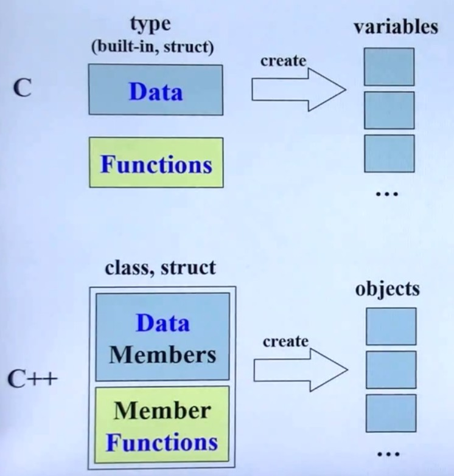
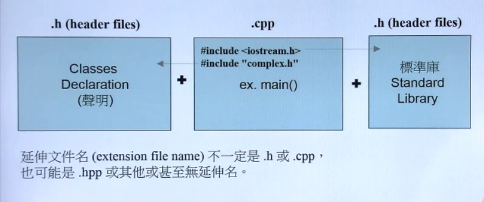
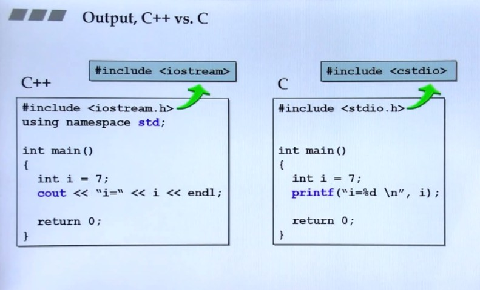
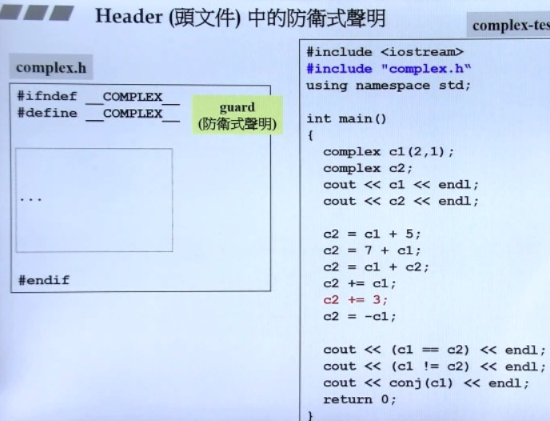
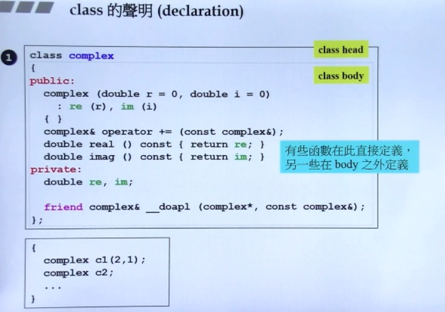
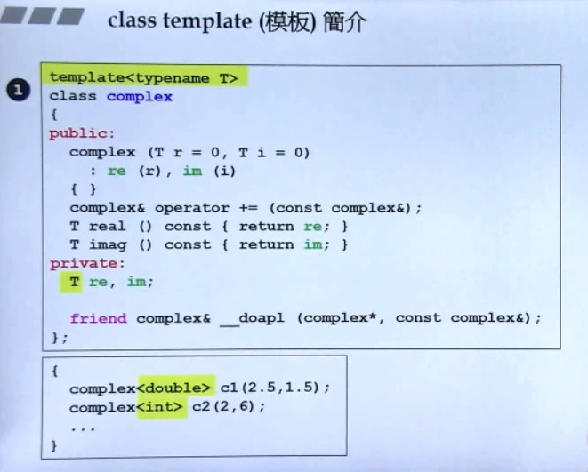

C++演化：
- c++98(1.0)
- c++03
- c++11(2.0)
- c++14

---

| C++      |      |
| -------- | ---- |
| 1.C++语言  |      |
| 2.C++标准库 |      |

书籍：
1. c++ primer
2. c++ programing language
3. effective C++
4. The C++ standard library
5. STL源码剖析

创建数据和函数：

